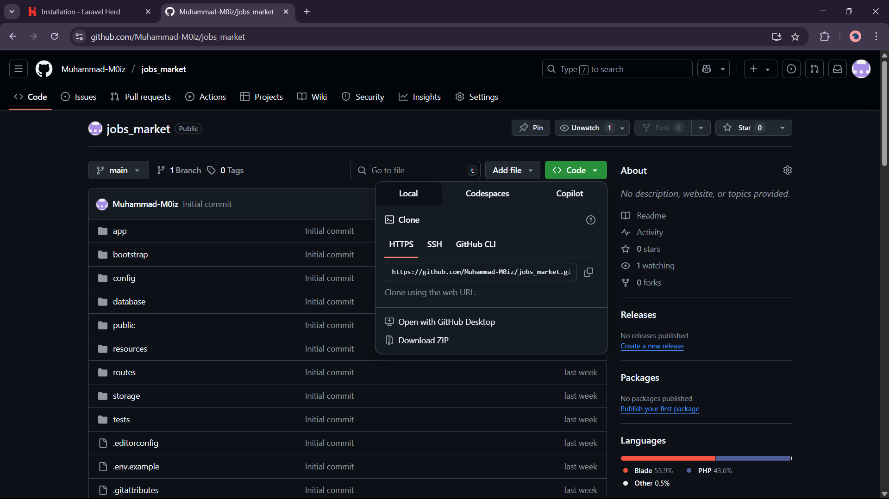
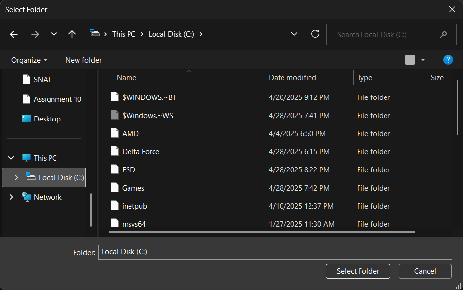

# Project Setup with Herd

This guide will walk you through setting up the project using Herd.

## Prerequisites

*   Git
*   Herd

## Setup Steps

1.  **Clone the Project Locally**

    Open your terminal and run the following command to clone the project repository:
    ```bash
    git clone https://github.com/Muhammad-M0iz/jobs_market.git
    ```
    This will download the project files into a new directory named `jobs_market`.

    

2.  **Install Herd**

    If you haven't already, download and install Herd from the official website: [https://herd.laravel.com/](https://herd.laravel.com/)

    

3.  **Configure the Project in Herd**

    *   Open Herd.
    *   Navigate to the 'Sites' tab or section.
    *   Follow the instructions in Herd to add a new site, referring to the configuration options similar to those shown below (this typically involves setting the site name and pointing to the project's public directory if applicable).

    

4.  **Link Existing Project**

    *   In Herd, use the option to link an existing project.
    *   This process is illustrated below. You will likely need to browse to the `jobs_market` directory that you cloned in Step 1.

    

5.  **Select Project from Explorer**

    *   Once linked, ensure the project is correctly identified by Herd. You might need to select the project folder (e.g., `c:\path\to\your\cloned\jobs_market`) within Herd's interface or your system's file explorer if prompted by Herd.

    

6.  **Verify the Setup**

    *   After Herd has configured the site, it will provide a local URL for your project (e.g., `http://jobs_market.test` or similar).
    *   Open your web browser and navigate to this URL.
    *   To check if the API is working, go to the following route:
        `http://<your-project-local-url>/api/jobs`
        (Replace `<your-project-local-url>` with the actual URL provided by Herd).

    You should see the expected JSON response from the jobs API.

    

## Troubleshooting

*   Ensure Herd's services (e.g., Nginx, PHP, MySQL if used) are running.
*   Check Herd's logs for any errors if the site doesn't load.
*   Verify your project's `.env` file or other configuration files are set up correctly for the local Herd environment.
